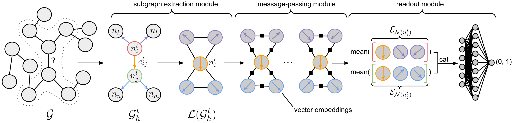

<!-- [](https://github.com/bwittmann/gav) -->
<!--  -->
# Graph Attentive Vectors (GAV) [](https://openaccess.thecvf.com/content/WACV2024/html/Wittmann_Link_Prediction_for_Flow-Driven_Spatial_Networks_WACV_2024_paper.html)



To run our proposed GAV framework on the ogbl-vessel benchmark, please follow the instructions below. The ogbl-vessel benchmark's data will be automatically downloaded and stored under `./dataset`.
For details, please check our paper and its extensive supplementary material.

## News
**January 24**: [*Link Prediction for Flow-Driven Spatial Networks*](https://openaccess.thecvf.com/content/WACV2024/html/Wittmann_Link_Prediction_for_Flow-Driven_Spatial_Networks_WACV_2024_paper.html) has been accepted and presented at WACV!

## Installation

Please create a new virtual environment using, e.g., anaconda:

    conda create --name gav python=3.8.15

Subsequently, install the required packages:

    pip install torch==1.13.1 --extra-index-url https://download.pytorch.org/whl/cu116

    pip install pyg_lib torch_scatter torch_sparse torch_cluster torch_spline_conv torch_geometric -f https://data.pyg.org/whl/torch-1.13.0+cu116.html

    pip install ogb tensorboard tqdm networkit

The installation was tested using Ubuntu 16.04 and CUDA 11.6. 
<!-- torch 1.13.1, torch-geometric 2.2.0, and ogb 1.3.5 -->


## Training

To train GAV, please run:

    python gav_link_pred.py --save_appendix <appendix> --gpu_id <gpu_id> --dataset ogbl-vessel

Checkpoints and tensorboard log files will be stored under `./results`.

## Testing

To test GAV's performance on an individual checkpoint, please run:

    python gav_link_pred.py --save_appendix <appendix_of_run_of_ckpt> --gpu_id <gpu_id> --dataset ogbl-vessel --only_test --continue_from <ckpt_epoch_nr>

To test GAV's performance on our provided checkpoint, please run:

    python gav_link_pred.py --save_appendix _gav --gpu_id <gpu_id> --dataset ogbl-vessel --only_test --continue_from 34


## Road Networks
### Preprocessing

To preprocess the road network datasets, please download the graph and coordinates from [here](https://www.cc.gatech.edu/dimacs10/archive/streets.shtml). The downloaded file from **Graph** should be called `edges.graph`, while the downloaded file from **Coordinates** should be called `nodes.graph`. Both files should be stored in an individual directory located at `<path_to_downloaded_files>`. Finally, run:

    python create_dataset.py --path <path_to_downloaded_files> --gpu_id <gpu_id> --dataset_name <e.g., ogbl-luxembourg_road>

Please note that in the preprocessing step, the `--dataset_name` has to start with `ogbl-` and should not include additional hyphens.

### Training and Testing

Follow the instructions above and simply state the processed dataset's name after the `--dataset` flag, omitting `ogbl-`. E.g., `--dataset luxembourg_road`.


## More Whole-Brain Vessel Graphs
### Preprocessing

To preprocess additional whole-brain vessel graphs, please download the **raw** data from [here](https://github.com/jocpae/VesselGraph).
The downloaded files should be stored in an individual directory located at `<path_to_downloaded_files>` Finally, run:

    python create_dataset.py --path <path_to_downloaded_files> --gpu_id <gpu_id> --dataset_name <e.g., ogbl-c57_tc_vessel>

Please note that in the preprocessing step, the `--dataset_name` has to start with `ogbl-` and should not include additional hyphens.

### Training and Testing

Follow the instructions above and simply state the processed dataset's name after the `--dataset` flag, omitting `ogbl-`. E.g., `--dataset c57_tc_vessel`.

## Citation
If you find our work useful for your research, please consider citing:
```bibtex
@InProceedings{Wittmann_2024_WACV,
    author    = {Wittmann, Bastian and Paetzold, Johannes C. and Prabhakar, Chinmay and Rueckert, Daniel and Menze, Bjoern},
    title     = {Link Prediction for Flow-Driven Spatial Networks},
    booktitle = {Proceedings of the IEEE/CVF Winter Conference on Applications of Computer Vision (WACV)},
    month     = {January},
    year      = {2024},
    pages     = {2472-2481}
}
```

<!-- ## Requirements tested during submission (for official GAV repo)
absl-py==1.4.0
blessed==1.20.0
cachetools==5.3.0
certifi==2023.5.7
charset-normalizer==3.1.0
contourpy==1.0.7
cycler==0.11.0
fonttools==4.39.4
google-auth==2.18.1
google-auth-oauthlib==1.0.0
gpustat==1.1
grpcio==1.54.2
idna==3.4
importlib-metadata==6.6.0
importlib-resources==5.12.0
Jinja2==3.1.2
joblib==1.2.0
kiwisolver==1.4.4
littleutils==0.2.2
Markdown==3.4.3
MarkupSafe==2.1.2
matplotlib==3.7.1
networkit==10.1
networkx==3.1
numpy==1.24.3
nvidia-ml-py==11.525.112
oauthlib==3.2.2
ogb==1.3.6
outdated==0.2.2
packaging==23.1
pandas==2.0.1
Pillow==9.5.0
protobuf==4.23.1
psutil==5.9.5
pyasn1==0.5.0
pyasn1-modules==0.3.0
pyg-lib==0.2.0+pt113cu116
pyparsing==3.0.9
python-dateutil==2.8.2
pytz==2023.3
requests==2.31.0
requests-oauthlib==1.3.1
rsa==4.9
scikit-learn==1.2.2
scipy==1.10.1
six==1.16.0
tensorboard==2.13.0
tensorboard-data-server==0.7.0
threadpoolctl==3.1.0
torch==1.13.1+cu116
torch-cluster==1.6.1+pt113cu116
torch-geometric==2.3.1
torch-scatter==2.1.1+pt113cu116
torch-sparse==0.6.17+pt113cu116
torch-spline-conv==1.2.2+pt113cu116
tqdm==4.65.0
typing_extensions==4.6.1
tzdata==2023.3
urllib3==1.26.16
wcwidth==0.2.6
Werkzeug==2.3.4
zipp==3.15.0 -->